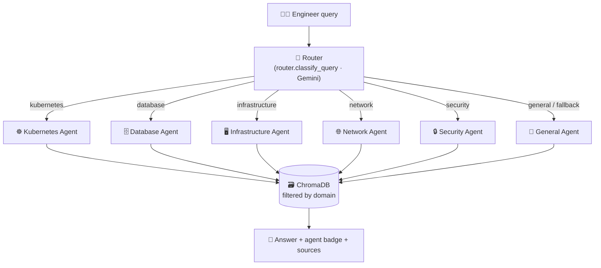

# AIOps Incident Response Assistant

> 🏆 **Capstone submission** for the Google × Kaggle
> [AI Agents: Intensive Vibe Coding Capstone Project](https://www.kaggle.com/competitions/vibecoding-agents-capstone-project/)
> (5-Day AI Agents Intensive, June 2026) — an agent team that solves a
> real-world problem: getting on-call engineers from alert to remediation, fast.

A RAG-powered chatbot that helps IT on-call engineers instantly find
remediation steps during incidents using LangChain, ChromaDB, Gemini, and Streamlit.
It uses a lightweight **multi-agent router**: each query is first classified into a
domain (kubernetes, database, infrastructure, network, security) and answered by a
specialist that retrieves only from that domain's runbooks.

---

## Tech Stack

| Component       | Tool                        |
|-----------------|-----------------------------|
| LLM             | Google Gemini 2.5 Flash     |
| Embeddings      | Google gemini-embedding-2   |
| Framework       | LangChain 1.x               |
| Vector Store    | ChromaDB (local)            |
| UI              | Streamlit                   |
| Language        | Python 3.12+                |

> **Note on model names:** Google periodically retires Gemini models. If you hit a
> `404 NOT_FOUND` for a model, list the currently available ones and update
> `EMBEDDING_MODEL` (embeddings) or `LLM_MODEL` (chat) in `rag_chain.py` — each is
> defined once there and imported everywhere else. The embedding model **must** be
> identical in ingest and query; changing it requires deleting `chroma_db/` and
> re-running `python ingest.py`.

---

## How It Works (Multi-Agent Routing)



Each specialist is built by `get_agent_chain(<domain>)` and retrieves only from
its domain's runbooks. The agents are defined as a registry in `agents.py`
(`ROUTER` + `AGENTS`), which `app.py` drives.

Each query flows through three steps:

1. **Route** — `router.classify_query()` makes one Gemini call to classify the
   query into a domain: `kubernetes`, `database`, `infrastructure`, `network`,
   `security`, or `general`.
2. **Retrieve (domain-scoped)** — `rag_chain.get_agent_chain(domain)` builds a
   RetrievalQA chain whose ChromaDB retriever is filtered by the `domain`
   metadata, so a specialist only sees its own runbooks. `general` applies no
   filter and searches everything.
3. **Answer + badge** — the app shows a coloured agent badge (☸️ Kubernetes,
   🗄️ Database, 🖥️ Infrastructure, 🌐 Network, 🔒 Security, 🧭 General) above the
   response, with the source runbooks listed underneath.

**Misroute fallback:** if the routed domain matches no runbook, the app
automatically retries unfiltered (`general`) so a wrong route never hides the
correct runbook. Note this means a routed query can make up to **two** Gemini
calls (route + answer), or three if the fallback triggers — pace usage on the
free tier.

The domains map 1:1 to the subfolders under `data/runbooks/`. The `domain`
metadata is written by `ingest.py` (derived from each file's subfolder) and read
back by the retriever filter — so adding a new domain is just a new subfolder
plus a re-ingest (and adding it to `DOMAINS` in `router.py`).

---

## Setup Instructions (Windows)

### Step 1: Clone or create the project folder
```
cd C:\Users\YourName\Documents
mkdir aiops-assistant
cd aiops-assistant
```

### Step 2: Create and activate virtual environment
```
python -m venv venv
venv\Scripts\activate
```

### Step 3: Install dependencies
```
pip install -r requirements.txt
```

### Step 4: Set up your API key
- Copy `.env.example` to `.env`
- Open `.env` and replace `your_gemini_api_key_here` with your actual key
- Get your Gemini API key from: https://aistudio.google.com/app/apikey

### Step 5: Add your runbooks
- Place your `.txt` or `.pdf` runbook files under `data/runbooks/<domain>/`
  (one subfolder per domain — the subfolder name becomes the routing domain)
- Sample runbooks across all domains are already included to get you started

### Step 6: Ingest documents into vector store
```
python ingest.py
```

### Step 7: Launch the app
```
streamlit run app.py
```

The app will open at: http://localhost:8501

---

## Deploying to Streamlit Cloud

1. Push this project to a GitHub repo (with `app.py` at the repo root).
2. On [share.streamlit.io](https://share.streamlit.io), create an app pointing at
   `app.py`.
3. Add your key under **Settings → Secrets** (Streamlit exposes secrets as
   environment variables, so `os.getenv("GOOGLE_API_KEY")` works):
   ```toml
   GOOGLE_API_KEY = "your_key_here"
   ```
4. **Ship the vector store.** This repo deliberately **commits** the prebuilt
   `chroma_db/` so a fresh deploy has a knowledge base from the first request.
   If you change the runbooks, re-run `python ingest.py` locally and commit the
   updated `chroma_db/`. (Alternative: run ingestion on the server at startup —
   but that needs the API key at runtime and spends embedding quota on every
   cold start.)

> **Note:** `requirements.txt` pins `protobuf` and the `opentelemetry-*` packages.
> Do not remove these — ChromaDB imports opentelemetry (which uses protobuf) at
> import time, and an unpinned resolve on Streamlit Cloud picks an incompatible
> `opentelemetry-proto`, crashing with *"Descriptors cannot be created directly"*.

> **Privacy note:** this pattern commits your runbooks *and* their embedded
> contents (`chroma_db/`) to the repo. That is fine for the included samples —
> but if you fork this with real internal runbooks, keep the repo **private**
> or take the store back out of git.

---

## Project Structure

```
aiops-assistant/
├── app.py                         # Streamlit UI (router -> agent -> badge)
├── agents.py                      # Agent registry: ROUTER + 6 named specialists
├── router.py                      # Classifies a query into a domain (Gemini)
├── rag_chain.py                   # RAG chain builder: get_agent_chain (domain-filtered)
├── ingest.py                      # Document ingestion pipeline (tags `domain`)
├── requirements.txt               # Python dependencies
├── LICENSE                        # MIT license
├── CLAUDE.md                      # Guidance for Claude Code sessions
├── .env.example                   # API key template
├── .env                           # Your actual API key (do not commit)
├── .gitignore
├── data/
│   └── runbooks/                  # One subfolder per domain
│       ├── kubernetes/
│       │   └── runbook_oom_kubernetes.txt
│       ├── database/
│       │   └── runbook_database.txt
│       ├── infrastructure/
│       │   ├── runbook_disk_space.txt
│       │   ├── runbook_high_cpu.txt
│       │   └── runbook_service_health.txt
│       ├── network/
│       │   ├── runbook_dns_failure.txt
│       │   └── runbook_high_latency.txt
│       └── security/
│           ├── runbook_unauthorized_access.txt
│           └── runbook_ssl_cert_expiry.txt
└── chroma_db/                     # Prebuilt vector store (committed for Streamlit Cloud)
```

> The subfolder name becomes each runbook's `domain` metadata. To add a domain,
> create a new subfolder, drop runbooks in, add the domain to `DOMAINS` in
> `router.py`, and re-run `python ingest.py`.

---

## Sample Queries to Test

- How do I resolve OOMKilled pods in Kubernetes?
- Steps to handle high CPU alert on a Linux server?
- Database connection pool exhausted - what to do?
- How to respond to a disk space alert?
- Service health check is failing - troubleshooting steps?

---

## Adding More Runbooks

1. Add your `.txt` or `.pdf` files to `data/runbooks/`
2. Rebuild the vector store (see **Updating the Vector Store (ChromaDB)** below)
3. Restart the Streamlit app

---

## Updating the Vector Store (ChromaDB)

The vector store in `chroma_db/` is built by `ingest.py` from the files in
`data/runbooks/`. Whenever you **add, edit, or remove** a runbook, rebuild it
so the app sees the change:

```powershell
python ingest.py
```

`ingest.py` automatically deletes any existing `chroma_db/` before rebuilding,
so re-running it never duplicates documents. Because `chroma_db/` is committed
(so Streamlit Cloud deploys ship a prebuilt knowledge base), commit the rebuilt
store afterwards. If the delete fails with an
"access denied" error, something is holding the folder open — stop the
Streamlit app (Ctrl+C), pause OneDrive sync if it is syncing the folder, and
re-run.

A successful rebuild prints `Loaded N document(s)` and `SUCCESS: N chunks
stored in ChromaDB`. Confirm `N` matches the number of runbooks you expect.

### When you must rebuild
- You added, edited, or deleted a runbook in `data/runbooks/`
- You changed `EMBEDDING_MODEL` in `rag_chain.py` (old/new embeddings are
  incompatible — a stale `chroma_db/` will cause wrong answers or a dimension error)
- The app reports `Knowledge base not found`

After rebuilding, **fully restart Streamlit** (Ctrl+C, then `streamlit run app.py`).
The domain chains are cached in-process, and the app's ⋮ menu → Clear cache does
**not** rebuild them — only a restart does.

---

## Troubleshooting

| Symptom | Cause | Fix |
|---------|-------|-----|
| `GOOGLE_API_KEY is not set` | No `.env` file or key missing | Copy `.env.example` to `.env` and paste your key |
| `404 NOT_FOUND ... is not found for API version` | The Gemini model name was retired | Update the model name in `rag_chain.py` (see the model note above) |
| `429 RESOURCE_EXHAUSTED ... limit: 0` | Model is paid-tier only (e.g. `gemini-2.5-pro`) | Switch to a free-tier model like `gemini-2.5-flash`, or enable billing |
| `429 RESOURCE_EXHAUSTED ... retry in Ns` | Free-tier rate/daily limit hit | Wait for the retry delay; limits reset over time |
| Model change in `rag_chain.py` has no effect in the running app | The chains are cached in-process (`lru_cache`) | Fully restart the app (Ctrl+C, re-run). The ⋮ menu → Clear cache does **not** rebuild them |
| `ModuleNotFoundError: No module named 'langchain...'` | Dependencies out of date | Re-run `pip install -r requirements.txt` |
| Answers seem unrelated to your runbooks, or a dimension error on query | Vector store was built with a different embedding model | Delete the `chroma_db/` folder and re-run `python ingest.py` |
| `Knowledge base not found` in the app | `ingest.py` was never run | Run `python ingest.py` before launching the app |

> **Important:** Whenever you change `EMBEDDING_MODEL`, you must delete `chroma_db/`
> and re-ingest. Embeddings from different models are not compatible.

---

## License

Released under the [MIT License](LICENSE) — free to use, modify, and distribute.

---

## Capstone Project

**Author:** Sarvesh Bedsur

Submitted to the [AI Agents: Intensive Vibe Coding Capstone Project](https://www.kaggle.com/competitions/vibecoding-agents-capstone-project/),
the capstone of the **Google × Kaggle 5-Day AI Agents Intensive — Vibe Coding**
course (June 2026). In the spirit of the course, the project was vibe-coded
with an AI coding agent (Claude Code): the multi-agent architecture, ingestion
pipeline, and deployment fixes were all built through iterative AI pair-work,
with `CLAUDE.md` serving as the agent's persistent project memory.
